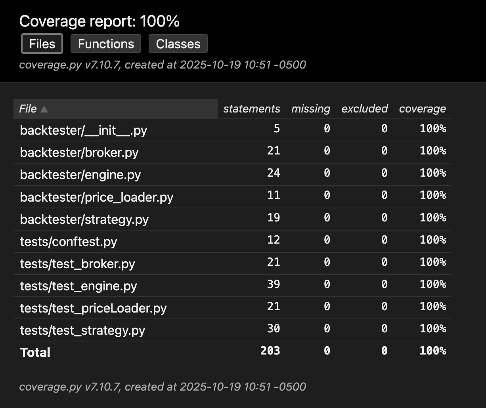

# FINM32500 HW5 — Backtesting CI Lab

## Overview
A minimal daily backtester built around synthetic data generation, a volatility breakout strategy, a simple broker, and an execution loop. The focus is deterministic unit testing, coverage, and CI automation.

## Design Notes
- **Price source** — [`backtester.price_loader.PriceLoader`](backtester/price_loader.py) emits seeded geometric-Brownian price paths to keep tests reproducible.
- **Strategy** — [`backtester.strategy.VolatilityBreakoutStrategy`](backtester/strategy.py) computes rolling volatility over a configurable lookback and returns signals in $\{-1,0,+1\}$.
- **Broker** — [`backtester.broker.Broker`](backtester/broker.py) updates cash/position for side-effect-free market orders and guards invalid requests.
- **Engine** — [`backtester.engine.Backtester`](backtester/engine.py) consumes strategy signals with a $t-1$ offset, routes orders to the broker, and reports terminal equity.
- **Tests & fixtures** — Core behavior is exercised in [tests/test_price_loader.py](tests/test_price_loader.py), [tests/test_strategy.py](tests/test_strategy.py), [tests/test_broker.py](tests/test_broker.py), and [tests/test_engine.py](tests/test_engine.py) using fixtures from [tests/conftest.py](tests/conftest.py).

## How to Run
```bash
pip install -r requirements.txt
coverage run -m pytest -q
coverage report -m
coverage html
```
The full HTML report will be available at [htmlcov/index.html](htmlcov/index.html).

## Continuous Integration
The GitHub Actions workflow in [`.github/workflows/ci.yml`](.github/workflows/ci.yml) runs on every push and pull request. It will:
1. Install dependencies from [`requirements.txt`](requirements.txt).
2. Execute the test suite with `coverage run -m pytest -q`.
3. Fail the build if line coverage drops below 90%.

## Coverage Summary
| Module | Coverage |
| --------------------------------------------------------- | -------- |
| [`backtester/__init__.py`](backtester/__init__.py)       | 100%     |
| [`backtester/broker.py`](backtester/broker.py)           | 100%     |
| [`backtester/engine.py`](backtester/engine.py)           | 100%     |
| [`backtester/price_loader.py`](backtester/price_loader.py) | 100%     |
| [`backtester/strategy.py`](backtester/strategy.py)       | 100%     |
| **Total**                                                 | **100%** |


